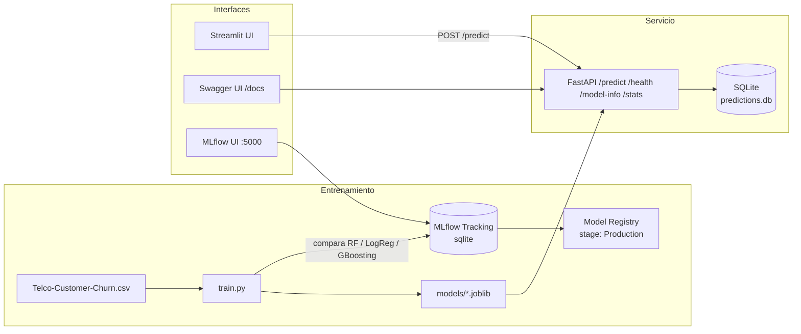

# Predicción de Deserción de Clientes (Churn) — Telco

Proyecto de posgrado: pipeline de MLOps completo para predecir el churn de
clientes de telecomunicaciones, con entrenamiento y comparación de modelos
en MLflow, una API en FastAPI, una interfaz Streamlit y despliegue con
Docker Compose.

## Arquitectura



## Servicios (Docker Compose)

| Servicio    | Puerto | Descripción                                             |
|-------------|--------|----------------------------------------------------------|
| `train`     | —      | Entrena y compara modelos, registra el mejor en MLflow    |
| `mlflow-ui` | 5000   | Interfaz de MLflow (experimentos, métricas, registry)      |
| `api`       | 8000   | FastAPI con `/predict`, `/health`, `/model-info`, `/stats` |
| `streamlit` | 8501   | Formulario web para ingresar parámetros y ver la predicción |

## Uso rápido

```bash
./run.sh train    # entrena y compara modelos, registra el mejor en MLflow
./run.sh start     # levanta api, mlflow-ui y streamlit
./run.sh test      # prueba /predict con un ejemplo
```

- API (Swagger): http://localhost:8000/docs
- MLflow UI: http://localhost:5000
- Interfaz Streamlit: http://localhost:8501

## Endpoints de la API

| Método | Ruta          | Descripción                                             |
|--------|---------------|-----------------------------------------------------------|
| GET    | `/`           | Estado general                                            |
| GET    | `/health`     | Health check                                              |
| GET    | `/model-info` | Metadata del modelo (tipo, features esperadas)             |
| POST   | `/predict`    | Predicción de churn dado un cliente                        |
| GET    | `/stats`      | Monitoreo: total de predicciones, tasa de churn observada, últimas 10 |

## Comparación de modelos

`train.py` entrena y compara 3 modelos sobre el mismo split de datos:

- `RandomForestClassifier` (baseline original)
- `LogisticRegression`
- `GradientBoostingClassifier`

Cada uno se loggea como un run separado en el experimento `churn_prediction`
de MLflow (parámetros, métricas: accuracy, precision, recall, f1, ROC-AUC).
El mejor modelo por `f1_score` se guarda en `models/*.joblib` (lo que usa la
API) **y** se registra en el MLflow Model Registry (`churn_model`, stage
`Production`).

## Monitoreo

Cada llamada a `/predict` se registra en `monitoring/predictions.db`
(SQLite): timestamp, input recibido, predicción y probabilidad. El endpoint
`/stats` expone el total de predicciones, la tasa de churn observada y las
últimas 10 predicciones — útil para mostrar en la sustentación cómo se
vería un dashboard básico de monitoreo en producción.

## Tests y CI

- `tests/test_api.py`: valida `/health`, `/model-info`, `/predict` (caso
  válido y caso con campos faltantes) y `/stats`.
- `.github/workflows/ci.yml`: en cada push/PR instala dependencias, entrena
  el modelo, corre los tests con `pytest` y construye las 3 imágenes Docker
  (api, train, streamlit) para verificar que el proyecto sigue siendo
  desplegable.

Para correr los tests localmente:

```bash
pip install -r requirements.txt -r requirements-dev.txt
python src/pipeline/train.py   # genera los artefactos que la API necesita
pytest tests/ -v
```

## Cambios respecto a la versión anterior

- Se eliminó la ambigüedad entre `docker-compose.yaml` y `docker-compose.yml`
  (usar solo este archivo).
- Se corrigió el comando del servicio `train`, que apuntaba a `src/train.py`
  en vez de `src/pipeline/train.py`.
- Se agregó el servicio `streamlit` con una interfaz de formulario.
- Se agregó logging de predicciones y el endpoint `/stats`.
- Se agregó comparación de modelos + registro en el Model Registry de MLflow.
- Se agregaron tests automatizados y un pipeline de CI en GitHub Actions.

## Limitaciones conocidas

- El registro en el Model Registry requiere un backend de base de datos
  (SQLite cumple); si migran a un `file store` de MLflow, el registry no
  funcionará.
- No hay reentrenamiento automático programado (cron) ni detección formal
  de *data drift*; el endpoint `/stats` da una foto básica de las
  predicciones recientes, no un análisis estadístico de drift.
- Los tests de CI entrenan el modelo con el dataset real si está presente
  en el repo, o generan datos sintéticos si no — verificar que
  `data/Telco-Customer-Churn.csv` esté versionado o documentar cómo
  obtenerlo (p. ej. Kaggle) antes de la entrega.
