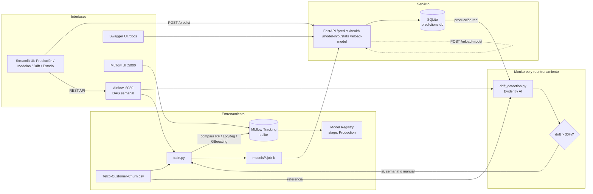

# Predicción de Deserción de Clientes (Churn) — Telco

Proyecto de posgrado: pipeline de MLOps completo para predecir el churn de
clientes de telecomunicaciones, con entrenamiento y comparación de modelos
en MLflow, una API en FastAPI, una interfaz Streamlit y despliegue con
Docker Compose.

## Arquitectura



## Servicios

**Stack base** (`docker-compose.yml`):

| Servicio    | Puerto | Descripción                                             |
|-------------|--------|----------------------------------------------------------|
| `train`     | —      | Entrena y compara modelos, registra el mejor en MLflow    |
| `mlflow-ui` | 5000   | Interfaz de MLflow (experimentos, métricas, registry)      |
| `api`       | 8000   | FastAPI con `/predict`, `/health`, `/model-info`, `/stats`, `/reload-model` |
| `streamlit` | 8501   | Interfaz con pestañas: Predicción, Comparación de Modelos, Drift & Reentrenamiento, Estado del Sistema |

**Stack de orquestación** (`docker-compose-airflow.yml`, opcional):

| Servicio             | Puerto | Descripción                                    |
|----------------------|--------|--------------------------------------------------|
| `postgres`            | —      | Base de datos de metadatos de Airflow             |
| `airflow-webserver`   | 8080   | UI de Airflow (usuario/clave: `airflow`/`airflow`) |
| `airflow-scheduler`   | —      | Ejecuta el DAG `churn_retraining_pipeline`         |
| `airflow-init`        | —      | Inicializa la base de datos y el usuario admin (corre una vez) |

## Uso rápido

```bash
./run.sh train          # entrena y compara modelos, registra el mejor en MLflow
./run.sh start           # levanta api, mlflow-ui y streamlit (sin Airflow)
./run.sh test            # prueba /predict con un ejemplo
./run.sh drift           # corre la detección de drift una sola vez, sin Airflow
./run.sh airflow-start   # levanta TODO, incluyendo Airflow, para el reentrenamiento programado
```

- API (Swagger): http://localhost:8000/docs
- MLflow UI: http://localhost:5000
- Interfaz Streamlit: http://localhost:8501
- Airflow UI: http://localhost:8080 (solo con `airflow-start`)

## Endpoints de la API

| Método | Ruta            | Descripción                                             |
|--------|-----------------|-----------------------------------------------------------|
| GET    | `/`             | Estado general                                            |
| GET    | `/health`       | Health check                                              |
| GET    | `/model-info`   | Metadata del modelo (tipo, features esperadas)             |
| POST   | `/predict`      | Predicción de churn dado un cliente                        |
| GET    | `/stats`        | Monitoreo: total de predicciones, tasa de churn observada, últimas 10 |
| POST   | `/reload-model` | Recarga model/scaler/encoders desde disco sin reiniciar el contenedor (la usa Airflow tras reentrenar) |

## Comparación de modelos

`train.py` entrena y compara 3 modelos sobre el mismo split de datos:

- `RandomForestClassifier`
- `LogisticRegression`
- `GradientBoostingClassifier`

Cada uno se loggea como un run separado en el experimento `churn_prediction`
de MLflow (parámetros, métricas: accuracy, precision, recall, f1, ROC-AUC).
El mejor modelo por `f1_score` se guarda en `models/*.joblib` (lo que usa la
API) **y** se registra en el MLflow Model Registry (`churn_model`, stage
`Production`).

## Monitoreo

Cada llamada a `/predict` se registra en `monitoring/predictions.db`
(SQLite): timestamp, input recibido, predicción y probabilidad. El endpoint
`/stats` expone el total de predicciones, la tasa de churn observada y las
últimas 10 predicciones — útil para mostrar en la sustentación cómo se
vería un dashboard básico de monitoreo en producción.

## Tests y CI

- `tests/test_api.py`: valida `/health`, `/model-info`, `/predict` (caso
  válido y caso con campos faltantes) y `/stats`.
- `.github/workflows/ci.yml`: en cada push/PR instala dependencias, entrena
  el modelo, corre los tests con `pytest` y construye las 3 imágenes Docker
  (api, train, streamlit) para verificar que el proyecto sigue siendo
  desplegable.

Para correr los tests localmente:

```bash
pip install -r requirements.txt -r requirements-dev.txt
python src/pipeline/train.py   # genera los artefactos que la API necesita
pytest tests/ -v
```

## Detección de drift y reentrenamiento automático

`src/drift_detection.py` usa **Evidently AI** para comparar el dataset de
entrenamiento (referencia) contra los datos de **producción reales**
reconstruidos a partir de `monitoring/predictions.db` — es decir, las
predicciones que la API fue registrando (no datos simulados, salvo que
todavía haya menos de 30 predicciones reales, en cuyo caso simula un lote
con corrimiento intencional solo para poder demostrar el flujo).

El DAG de Airflow `churn_retraining_pipeline` (`dags/churn_retraining_dag.py`)
corre **automáticamente cada semana** (`schedule_interval='@weekly'`):

1. `check_data_availability` — confirma que el dataset existe
2. `detect_drift` — corre `drift_detection.py`, guarda un reporte HTML en
   `reports/` y las métricas en el experimento `drift_monitoring` de MLflow
3. `decide_retrain` — si el % de features con drift supera 30%, sigue a
   reentrenar; si no, salta directo a `end`
4. `retrain_model` — corre `train.py` (compara los 3 modelos, registra el
   mejor en el Model Registry)
5. `reload_api_model` — le pide a la API, por HTTP (`POST /reload-model`),
   que recargue los artefactos desde disco — sin reiniciar el contenedor
   y sin que Airflow necesite tocar Docker directamente

También puedes disparar este mismo DAG a demanda desde la pestaña
**"Drift & Reentrenamiento"** de Streamlit, o correr solo la detección de
drift sin Airflow con `./run.sh drift`.

Se usa una imagen propia de Airflow (`Dockerfile.airflow`) porque la imagen
oficial `apache/airflow` no trae pandas, scikit-learn, mlflow ni evidently.
`Dockerfile.airflow` junto con `requirements-airflow.txt` dejan esas
dependencias instaladas de forma reproducible con un solo
`docker-compose build`, sin tener que instalarlas a mano dentro del
contenedor cada vez que alguien levanta el proyecto desde cero.

La API expone `/reload-model` para recargar el modelo, el scaler y los
encoders desde disco sin reiniciar el contenedor. Esto es lo que usa
Airflow al final del pipeline de reentrenamiento, así no necesita acceso al
socket de Docker para reiniciar nada.

## Limitaciones conocidas

- El registro en el Model Registry requiere un backend de base de datos
  (SQLite cumple); si migran a un `file store` de MLflow, el registry no
  funcionará.
- El stack de Airflow (Postgres + webserver + scheduler) es pesado; si la
  máquina tiene poca RAM, usa `./run.sh start` (sin Airflow) para el día a
  día y `./run.sh airflow-start` solo cuando quieras mostrar/probar el
  reentrenamiento programado.
- La detección de drift con datos reales necesita al menos 30 predicciones
  registradas en `monitoring/predictions.db`; antes de eso usa un lote
  simulado (claramente marcado en el log y en MLflow como
  `used_real_production_data=False`).
- Los tests de CI entrenan el modelo con el dataset real si está presente
  en el repo, o generan datos sintéticos si no — verificar que
  `data/Telco-Customer-Churn.csv` esté versionado o documentar cómo
  obtenerlo (p. ej. Kaggle) antes de la entrega.
